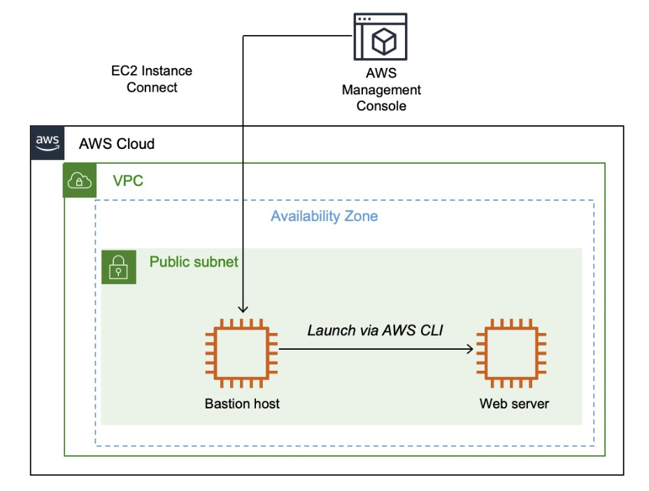
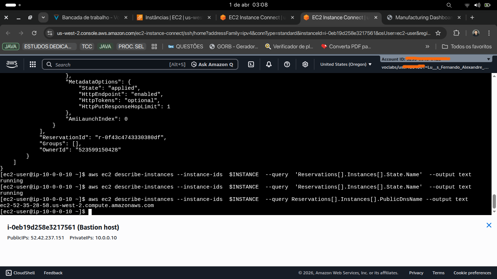
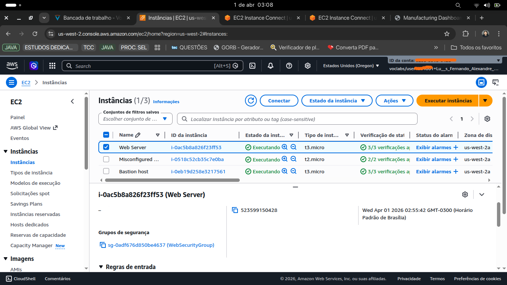
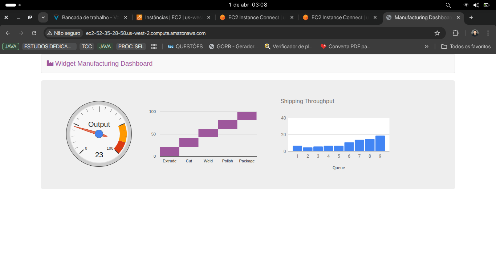

# AWS Infrastructure: EC2 Bastion Host & CLI Automation 🚀

Este projeto demonstra o provisionamento de uma arquitetura de rede segura na AWS, utilizando uma instância **Bastion Host** para gerenciar de forma segura o lançamento de um **Servidor Web** via **AWS CLI**.

## 📌 Visão Geral

A arquitetura foi desenhada para separar as responsabilidades de gerenciamento e entrega de aplicação. O Bastion Host atua como o ponto de entrada administrativo, permitindo automação programática dentro do ambiente cloud sem expor diretamente as APIs de controle à internet aberta.

### 🎯 Objetivos Concluídos

- **Provisionamento Híbrido:** Uso do AWS Management Console (Manual) e AWS CLI (Automatizado).
- **Segurança de Rede:** Configuração de VPC, Subnets Públicas e Grupos de Segurança específicos.
- **Gestão de Identidade:** Utilização de instâncias com perfis IAM (Roles) para acesso seguro a serviços AWS (Systems Manager).
- **Automação de Boot:** Uso de **User Data Scripts** para instalação e configuração automática do Apache (httpd).

---

## 🏗️ Arquitetura do Projeto

Abaixo, o diagrama que representa a topologia da rede e o fluxo de lançamento das instâncias:

---

## 🛠️ Tecnologias e Ferramentas

- **Computação:** Amazon EC2 (Família T3).
- **Imagens:** Amazon Linux 2 (HVM).
- **Automação:** Shell Scripting (Bash) & AWS CLI.
- **Configuração:** AWS Systems Manager (Parameter Store) para busca dinâmica de AMIs.

---

## 🚀 Implementação e Resultados

### 1. Automação via CLI

Utilizei scripts para recuperar dinamicamente os IDs de sub-rede, grupos de segurança e a última imagem disponível (AMI) para garantir que a infraestrutura seja sempre atualizada e repetível.

_Execução do script de provisionamento através do Bastion Host._

### 2. Gestão de Instâncias

O resultado final no Console da AWS apresenta uma infraestrutura organizada e devidamente etiquetada (Tags), facilitando a gestão de custos e recursos.

### 3. Aplicação em Produção

O servidor web provisionado via CLI instala automaticamente o Apache e realiza o deploy de uma aplicação de Dashboard funcional.

---

## 🔍 Troubleshooting (Habilidades Resolutivas)

Durante o laboratório, foram simulados cenários de erro propositais para testar habilidades de diagnóstico:

- **Problema de Conectividade:** Identificação de falta de regra SSH (porta 22) no Security Group.
- **Falha no Servidor Web:** Verificação de porta 80 bloqueada e status do serviço `httpd` via terminal.

---

## 📂 Estrutura do Repositório

- `/scripts`: Contém os scripts `.sh` de automação e testes de SSM.
- `/diagrams`: Desenho técnico da arquitetura.
- `/screenshots`: Evidências de execução e funcionamento do projeto.

---

## ✍️ Autor

**Luis Fernando Alexandre dos Santos**

