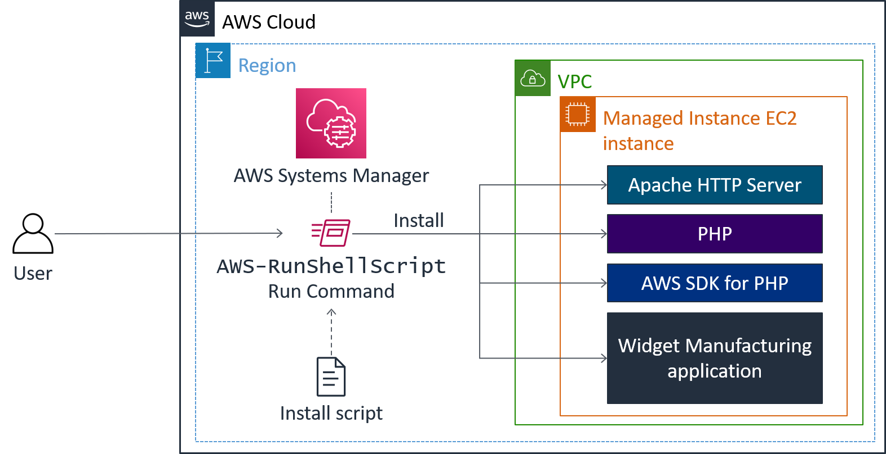
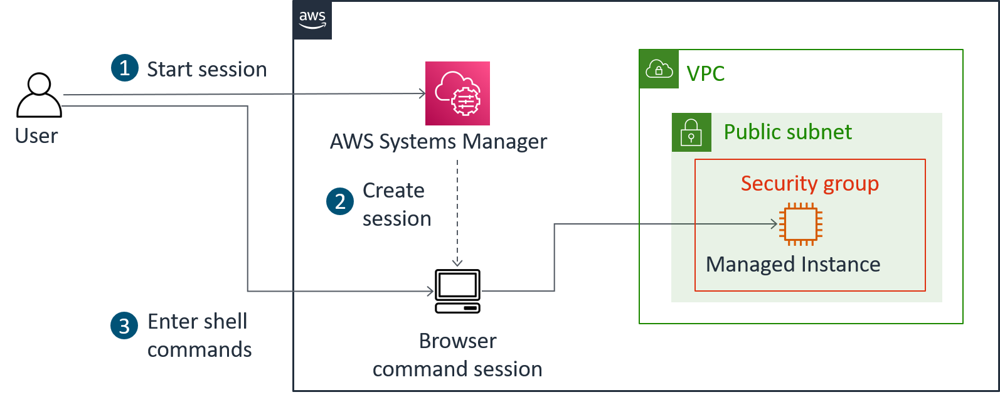

# ☁️ AWS Systems Manager: Fleet Management & Automation

Este repositório contém o registro prático de operações de gerenciamento de infraestrutura em escala utilizando o **AWS Systems Manager (SSM)**. O foco do projeto é a automação de tarefas operacionais, gerenciamento de configurações e acesso seguro a instâncias EC2 sem a necessidade de chaves SSH ou portas abertas.

> "Na engenharia, a automação não é apenas sobre velocidade, mas sobre consistência e segurança. Este laboratório demonstra como gerenciar frotas de servidores de forma centralizada e auditável."

---

## 🎯 Objetivos do Projeto

- [x] **Inventário Automatizado:** Coleta de metadados e software instalado via Fleet Manager.
- [x] **Execução de Comandos em Escala:** Deploy de aplicação web (Apache/PHP) utilizando Run Command.
- [x] **Externalização de Configurações:** Uso do Parameter Store para _Feature Toggles_.
- [x] **Acesso Seguro (Zero Trust):** Gerenciamento de instâncias via Session Manager (sem porta 22).

---

## 🏗️ Arquitetura das Soluções

### 1. Instalação via Run Command

Utilização de documentos do SSM para instalar o servidor Apache, PHP e o SDK da AWS de forma remota e simultânea.


### 2. Acesso via Session Manager

Substituição do SSH tradicional por sessões autenticadas via IAM, garantindo auditoria total via CloudTrail.


---

## 🛠️ Tecnologias Utilizadas

- **AWS Systems Manager:** Fleet Manager, Run Command, Parameter Store, Session Manager.
- **Amazon EC2:** Instâncias Linux gerenciadas.
- **AWS CLI:** Consultas de metadados e recursos via terminal.
- **Apache & PHP:** Stack da aplicação instalada.

---

## 📝 Comandos Executados no Terminal (Session Manager)

Durante o acesso direto à instância, foram validadas as permissões de IAM e o deploy da aplicação:

```bash
# Verificação dos arquivos da aplicação instalada
ls /var/www/html

# Consulta dinâmica de metadados da instância (Região e Detalhes)
AZ=`curl -s http://169.254.169.254/latest/meta-data/placement/availability-zone`
export AWS_DEFAULT_REGION=${AZ::-1}
aws ec2 describe-instances
```
