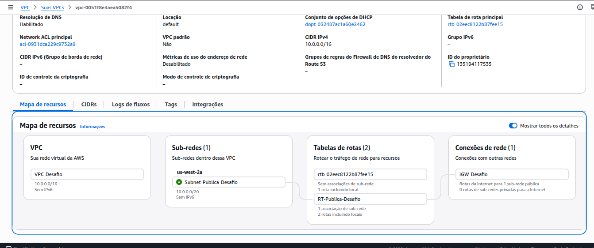
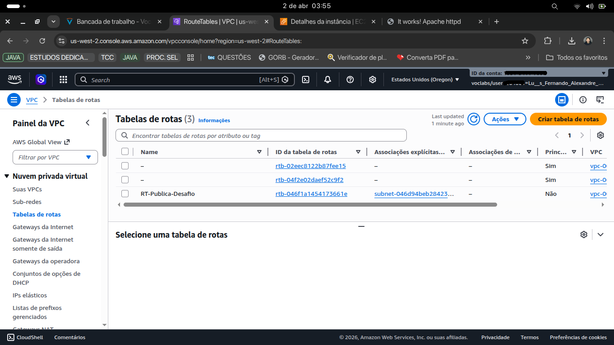
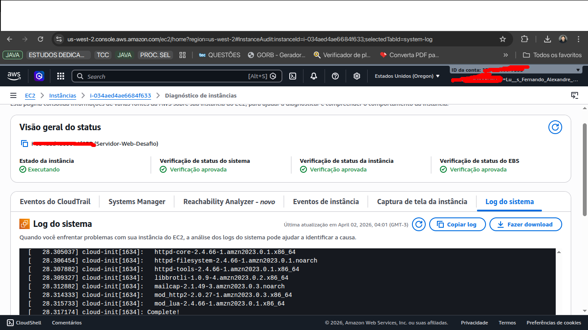
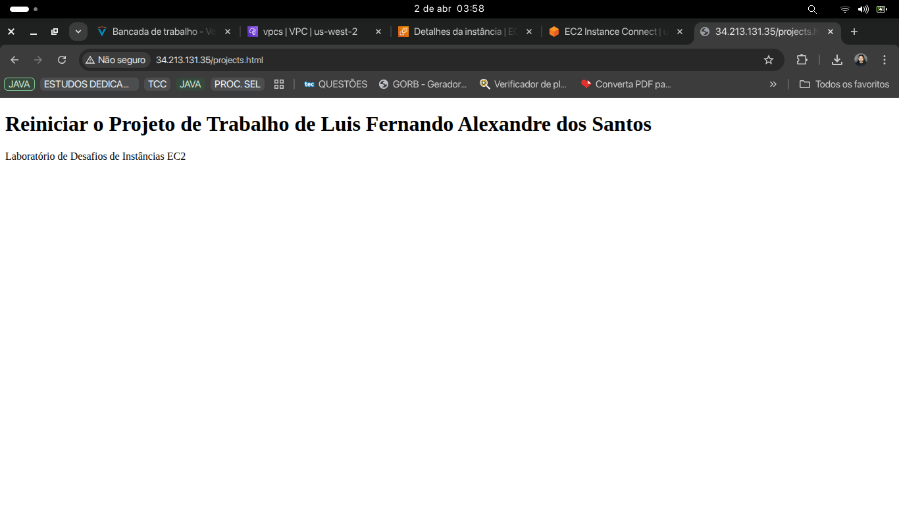

# AWS Infrastructure: EC2 Web Server & Networking Architecture 🚀

Este projeto demonstra a configuração de uma infraestrutura de rede completa na AWS, desde a criação de uma **VPC personalizada** até o deploy automatizado de um **Servidor Web Apache**, utilizando **Ubuntu Linux** como estação de gerenciamento local.

## 📌 Visão Geral

O objetivo principal foi isolar recursos em uma rede própria (**VPC-Desafio**), garantindo que o servidor web fosse configurado automaticamente no primeiro boot através de **User Data Scripts**, eliminando a necessidade de configuração manual pós-lançamento.

### 🎯 Objetivos Concluídos

- **Infraestrutura de Rede:** Criação de VPC, Subnets Públicas, Internet Gateway e Tabelas de Rotas.
- **Automação de Boot:** Implementação de scripts Shell para instalação automática do Apache (httpd).
- **Segurança:** Configuração de Security Groups específicos para tráfego HTTP (80) e SSH (22).
- **Gerenciamento CLI:** Utilização da AWS CLI v2 para interação programática com o ambiente Cloud.

---

## 🏗️ Arquitetura do Projeto

Abaixo, o diagrama técnico representando a topologia da rede e o fluxo de comunicação entre os componentes:

---

## 🛠️ Tecnologias e Ferramentas

- **Cloud:** Amazon Web Services (AWS).
- **Computação:** instâncias EC2 (Família T3).
- **Servidor Web:** Apache HTTP Server.
- **S.O. Local:** Ubuntu Linux via Terminal.
- **Scripting:** Bash (Shell Script).

---

## 🚀 Implementação e Evidências

### 1. Mapa de Recursos (VPC)

Configuração visual da rede demonstrando a sub-rede pública devidamente roteada.

### 2. Conectividade e Rotas

Validação das tabelas de rotas e do Internet Gateway anexado para permitir acesso externo.

### 3. Automação (User Data)

Logs de sistema que comprovam a execução do script de instalação automática durante a inicialização da instância.

### 4. Resultado Final

Servidor web online e renderizando a página HTML personalizada com sucesso.

---

## 🔍 Troubleshooting & Aprendizados

Durante o desenvolvimento, foram aplicadas técnicas de diagnóstico para garantir a integridade do ambiente:

- **Diagnóstico de Rede:** Verificação de regras de entrada no Security Group para liberar tráfego web.
- **Permissões Linux:** Ajuste de propriedade do diretório `/var/www/html` para permitir manipulação de arquivos pelo usuário padrão.
- **Gestão de Chaves:** Uso de `chmod 400` para proteção de chaves PEM no ambiente Linux local.

---

## 📂 Estrutura do Repositório

- `/diagrams`: Desenhos técnicos da arquitetura.
- `/screenshots`: Registros visuais das etapas concluídas.
- `/scripts`: Script para testes de SSM e automação.

---

## ✍️ Autor

**Luis Fernando Alexandre dos Santos**

