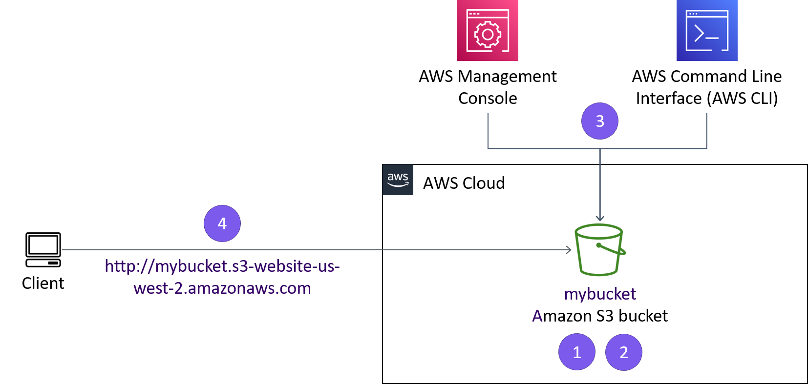
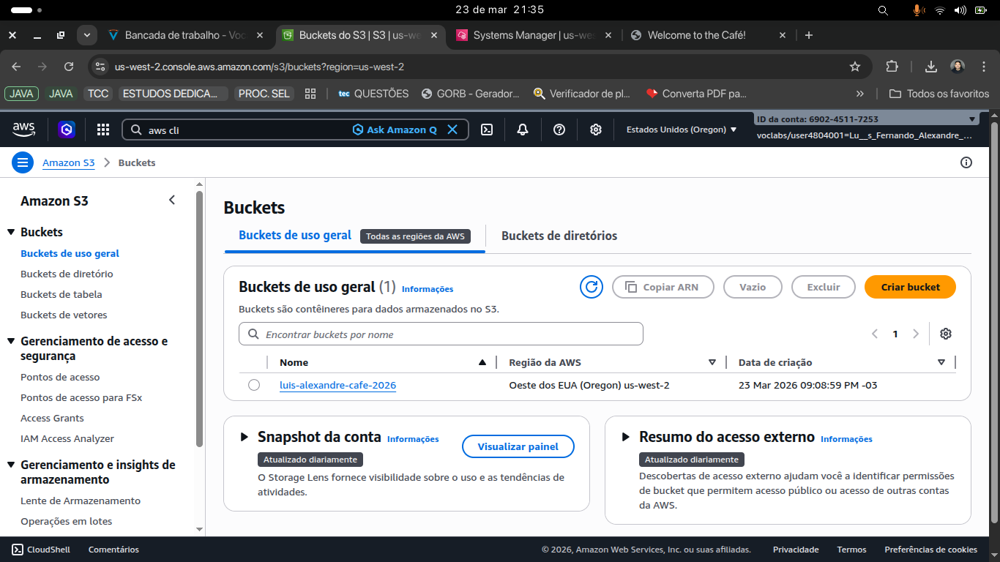
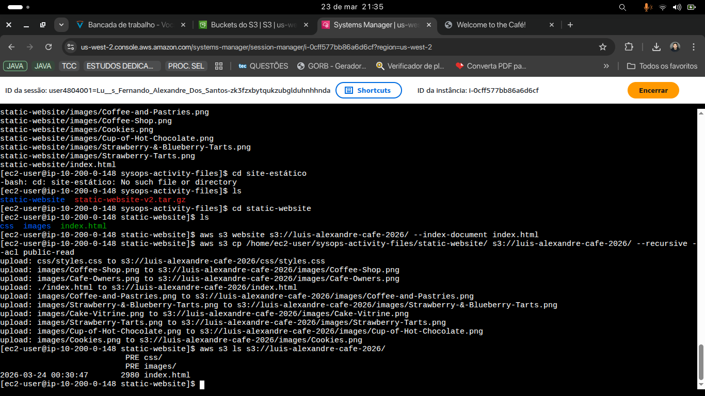
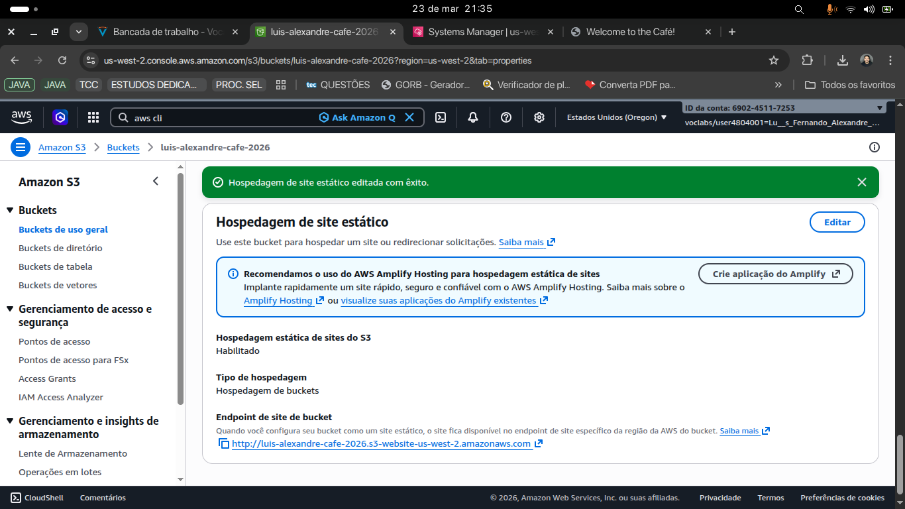
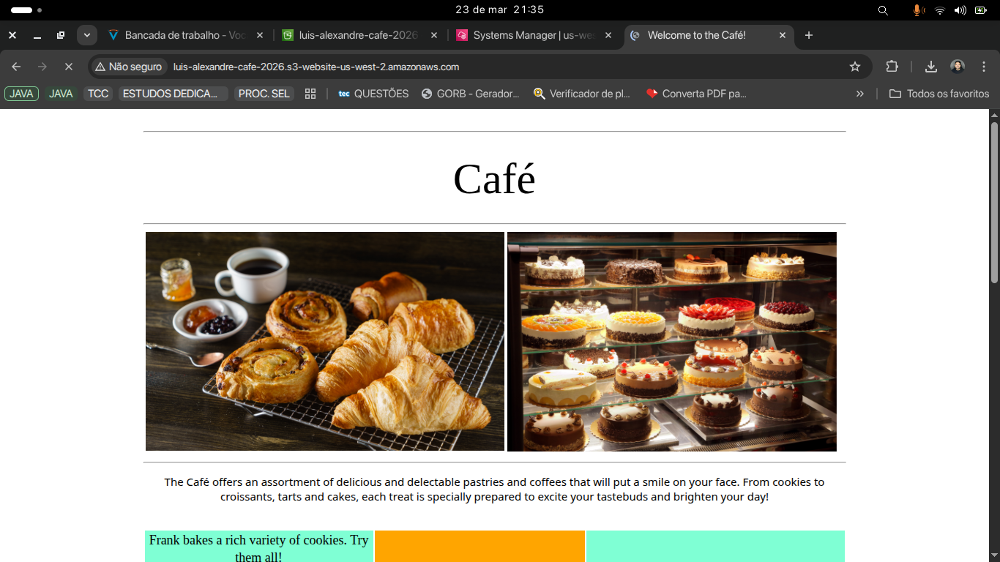

# ☁️ AWS S3 Static Website Deployment

> **Hands-on cloud project** — Deploying a static website on Amazon S3 using AWS CLI, IAM, and Bash scripting.


---

## 📌 Overview

This project demonstrates a **real-world cloud deployment pipeline** using Amazon Web Services. A static website for a _Café & Bakery_ was hosted on Amazon S3, with all infrastructure configured entirely through the **AWS CLI** — simulating an automated DevOps workflow.

The project covers IAM user management, bucket permissions, static hosting configuration, and deployment automation using Bash scripts.

---

## 🏗️ Architecture



> The diagram above shows the full flow: AWS Management Console + AWS CLI → file upload to S3 bucket → publicly accessible website via S3 static hosting endpoint.

---

## 🚀 Technologies Used

| Technology                | Purpose                                 |
| ------------------------- | --------------------------------------- |
| **Amazon S3**             | Static website hosting                  |
| **AWS CLI**               | Infrastructure as code                  |
| **IAM**                   | User creation & permission management   |
| **EC2 (Session Manager)** | Remote terminal via AWS Systems Manager |
| **Bash**                  | Deployment automation script            |

---

## ⚙️ Steps Performed

### 1. Configured AWS CLI on EC2

```bash
aws configure
# AWS Access Key ID, Secret Key, Region: us-west-2, Output: json
```

### 2. Created S3 Bucket via CLI

```bash
aws s3api create-bucket \
  --bucket luis-alexandre-cafe-2026 \
  --region us-west-2 \
  --create-bucket-configuration LocationConstraint=us-west-2
```

### 3. Created IAM User with S3 Full Access

```bash
aws iam create-user --user-name awsS3user
aws iam create-login-profile --user-name awsS3user --password Training123!
aws iam attach-user-policy \
  --policy-arn arn:aws:iam::aws:policy/AmazonS3FullAccess \
  --user-name awsS3user
```

### 4. Enabled Static Website Hosting

```bash
aws s3 website s3://luis-alexandre-cafe-2026/ --index-document index.html
```

### 5. Uploaded Files with Public Read ACL

```bash
aws s3 cp /home/ec2-user/sysops-activity-files/static-website/ \
  s3://luis-alexandre-cafe-2026/ \
  --recursive \
  --acl public-read
```

### 6. Automated Deployment with Bash Script

```bash
#!/bin/bash
aws s3 sync /home/ec2-user/sysops-activity-files/static-website/ \
  s3://luis-alexandre-cafe-2026/ \
  --acl public-read
```

> **Optimization**: Replaced `aws s3 cp` with `aws s3 sync` — only modified files are uploaded, reducing transfer time and resource consumption.

---

## 📂 Repository Structure

```
aws-s3-static-website-deployment/
│
├── scripts/
│   └── update-website.sh
│
├── screenshots/
│   ├── s3-bucket-created.png
│   ├── static-hosting-enabled.png
│   ├── cli-upload.png
│   ├── website-live.png
│   └── architecture-diagram.png
│
└── README.md
```

---

## 🌐 Live Result

The website was successfully deployed and made publicly accessible via the S3 static website endpoint:

```
http://luis-alexandre-cafe-2026.s3-website-us-west-2.amazonaws.com
```

---

## 📸 Screenshots

### S3 Bucket Created



> AWS S3 console showing the bucket `luis-alexandre-cafe-2026` created in the us-west-2 (Oregon) region on March 23, 2026.

---

### Static Website Hosting Enabled



> Static website hosting successfully activated on the S3 bucket, displaying the automatically generated public endpoint.

---

### CLI Upload in Action



> SSH terminal via AWS Systems Manager showing the upload of all website files (HTML, CSS and images) to the S3 bucket using `aws s3 cp` with `--recursive` and `--acl public-read` flags.

---

### Website Live



> The Café & Bakery website live and publicly accessible via the S3 endpoint (`luis-alexandre-cafe-2026.s3-website-us-west-2.amazonaws.com`).

---

## 💡 Key Learnings

- **AWS CLI proficiency** — managing cloud resources without touching the AWS Console
- **IAM best practices** — creating scoped users with specific service policies
- **Static hosting on S3** — enabling web hosting, configuring public ACLs, and verifying endpoint
- **Deployment automation** — writing reusable Bash scripts for repeatable deploys
- **`cp` vs `sync`** — understanding the efficiency difference between full upload vs incremental sync

---

## 👤 Author

**Luís Fernando Alexandre dos Santos**  
Cloud & Backend Developer | AWS Practitioner

[](https://linkedin.com/in/luisfernando-eng)
[](https://github.com/luisFernandoJv)

---

> _This project was developed as part of an AWS SysOps hands-on lab, simulating a real-world cloud deployment scenario._
